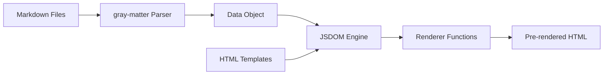

# Development Guide

> [!SUMMARY] Overview
> This guide helps new developers get up to speed with the portfolio codebase quickly. Follow the learning path to understand the architecture, make your first change, and contribute effectively.
> 
> **Branch Strategy:** `prod` (deployment), `dev` (integration), `feature-*` (work)
> **Estimated Time:** 1-2 hours for basics, 4-6 hours for full proficiency
> **Prerequisites:** Node.js, basic JavaScript, HTML/CSS knowledge

---

## Learning Path Overview

```mermaid
gantt
    title Developer Onboarding Timeline
    dateFormat  X
    axisFormat  %H hrs
    
    section Foundation
    Environment Setup     :0, 30m
    Project Structure     :30m, 30m
    First Build           :1h, 30m
    
    section Core Concepts
    Content System        :1h30m, 45m
    Build Process         :2h15m, 45m
    Runtime Modules       :3h, 45m
    
    section Hands-On
    First Content Change  :3h45m, 30m
    First Code Change     :4h15m, 45m
    Testing & Deployment  :5h, 30m
```

---

## 1. Environment Setup (30 minutes)

### 1.1 Prerequisites

| Tool | Version | Installation |
|------|---------|--------------|
| Node.js | 18+ | [nodejs.org](https://nodejs.org/) |
| npm | 9+ | Included with Node.js |
| Git | Latest | [git-scm.com](https://git-scm.com/) |
| Code Editor | Any | VS Code recommended |

### 1.2 Verify Installation

```bash
node --version    # Should show v18.x or higher
npm --version     # Should show 9.x or higher
git --version     # Should show git version
```

### 1.3 Clone Repository

```bash
git clone https://github.com/Aayushyaash/portfolio.git
cd portfolio
```

### 1.4 Install Dependencies

```bash
npm install
```

This installs:
- Build dependencies (jsdom, gray-matter, glob)
- Styling dependencies (tailwindcss, postcss)
- Vendor libraries (dompurify)

### 1.5 Verify Setup

```bash
npm run build
```

Expected output:
```
Starting build...
Step 1: Preparing Data & Config...
Step 2: Cleaning dist...
Step 3: Processing HTML & SSG...
[SSG] Injecting scripts for index.html...
[SSG] Rendered index.html.
Generated index.html (SSG Complete)
...
Build complete - SSG Active.
```

---

## 2. Project Structure (30 minutes)

### 2.1 Directory Overview

```
portfolio/
├── assets/              # 📝 Content (EDIT THIS!)
│   ├── profile.md       # Your profile
│   ├── projects/        # Project entries
│   ├── resume.md        # Resume content
│   ├── timeline.md      # Career timeline
│   ├── theme.json       # Theme config
│   ├── images/          # Images
│   └── files/           # Downloads (PDF)
├── src/                 # 💻 Source Code
│   ├── js/
│   │   ├── ui/          # Renderers
│   │   ├── utils/       # Helpers
│   │   └── main.js      # Entry point
│   ├── css/             # Styles
│   ├── partials/        # HTML partials
│   ├── index.html       # Main template
│   └── resume.html      # Resume template
├── scripts/             # 🔧 Build Tools
│   └── build.js         # SSG script
├── dist/                # 📦 Build Output (generated)
└── docs/                # 📚 Documentation
```

### 2.2 Key Files Reference

| File | Purpose | Edit Frequency |
|------|---------|----------------|
| `assets/profile.md` | Profile info | Occasionally |
| `assets/projects/*.md` | Projects | Frequently |
| `scripts/build.js` | Build logic | Rarely |
| `src/js/ui/renderer.js` | UI rendering | Rarely |
| `.github/workflows/static.yml` | CI/CD | Once |

---

## 3. First Build (30 minutes)

### 3.1 Build Commands

```bash
# Full build (SSG + CSS)
npm run build

# CSS only
npm run build:css

# Build + local server
npm run dev

# Clean dist folder
npm run clean
```

### 3.2 Run Local Development Server

```bash
npm run dev
```

This will:
1. Run the build
2. Start a local server (usually port 3000)

Then manually open `http://localhost:3000` in your browser.
### 3.3 Build Output Inspection

After building, explore `dist/`:

```bash
ls -la dist/
# index.html, resume.html, css/, js/, images/, data/
```

Check the pre-rendered HTML:

```bash
# View generated HTML (first 50 lines)
head -50 dist/index.html
```

---

## 4. Content System (45 minutes)

### 4.1 Understanding Frontmatter

Content files use YAML frontmatter:

```yaml
---
title: "My Project"
description: "Short description"
tags: ["JavaScript", "React"]
featured: true
order: 1
---

Markdown body content...
```

### 4.2 Exercise: Update Profile

1. Open `assets/profile.md`
2. Change your name or bio
3. Save the file
4. Run `npm run build`
5. Refresh browser to see changes

### 4.3 Exercise: Add a Project

1. Create `assets/projects/my-project.md`
2. Add frontmatter:

```yaml
---
title: "My New Project"
description: "A brief description"
tags: ["Python", "FastAPI"]
githubLink: "https://github.com/username/repo"
externalLink: "#"
image: "./images/project.png"
featured: true
order: 2
---

Project details in Markdown...
```

3. Add an image to `assets/images/`
4. Run `npm run build`
5. Verify in browser

---

## 5. Build Process (45 minutes)

### 5.1 How SSG Works



### 5.2 Read the Build Script

Open `scripts/build.js` and trace through:

1. **Step 1:** Data preparation (lines 50-91)
2. **Step 2:** Clean dist (lines 92-96)
3. **Step 3:** SSG processing (lines 97-278)
4. **Step 4:** Asset copying (lines 279-319)
5. **Step 5:** Meta files (lines 320-339)

### 5.3 Key Build Concepts

| Concept | Description |
|---------|-------------|
| **gray-matter** | Parses YAML frontmatter from Markdown |
| **JSDOM** | Virtual DOM for server-side rendering |
| **Script transformation** | Converts ES modules for JSDOM execution |
| **Template injection** | Replaces `{{VARIABLE}}` placeholders |

---

## 6. Runtime Modules (45 minutes)

### 6.1 Module Architecture

```
src/js/
├── main.js              # Entry point
├── ui/
│   ├── renderer.js      # Profile & projects
│   ├── resumeRenderer.js # Resume page
│   ├── timelineRenderer.js # Timeline
│   ├── filtering.js     # Skill filter
│   └── navigation.js    # Scroll spy
└── utils/
    ├── htmlHelpers.js   # HTML utilities
    └── errorHandler.js  # Error handling
```

### 6.2 Trace the Initialization

1. Open `src/js/main.js`
2. Follow the `initApp()` function
3. See how each module is initialized

### 6.3 Exercise: Add Console Logging

1. Open `src/js/main.js`
2. Add logging to `initApp()`:

```javascript
async function initApp() {
    console.log('🚀 Portfolio initializing...');
    try {
        // ... existing code
        console.log('✅ Portfolio ready!');
    } catch (error) {
        console.error('❌ Initialization failed:', error);
    }
}
```

3. Run `npm run dev`
4. Open browser console to see logs

---

## 7. First Content Change (30 minutes)

### 7.1 Update Skills

1. Open `assets/profile.md`
2. Find the `skills` section:

```yaml
skills:
  frontend: "React, Tailwind CSS, JavaScript, HTML5."
  backend: "FastAPI, Django, Flask, Node.js."
  database: "PostgreSQL, SQLite, Redis."
  devops: "Git/GitHub, Google Cloud."
```

3. Update with your skills
4. Run `npm run build`
5. Verify in browser

### 7.2 Update Timeline

1. Open `assets/timeline.md`
2. Add a new milestone:

```yaml
milestones:
  - title: "New Achievement"
    type: "ACHIEVEMENT"
    typeColor: "accent"
    date: "2024"
    dateRange: "2024"
    organization: "Organization Name"
    organizationIcon: "emoji_events"
    summary: "Brief summary"
    description: "Full description..."
    leftBox:
      title: "Details"
      icon: "info"
      items:
        - "Detail 1"
        - "Detail 2"
```

3. Run `npm run build`
4. Test timeline interaction

---

## 8. First Code Change (45 minutes)

### 8.1 Understanding the Renderer

Open `src/js/ui/renderer.js`:

```javascript
export function renderProfile(profile) {
    if (!profile) return;
    
    // Update header
    setText('#nav-profile-firstname', firstName);
    setText('#nav-profile-subtitle', profile.subtitle);
    
    // Update hero
    setText('#hero-bio', profile.bio);
    
    // ... more rendering
}
```

### 8.2 Exercise: Add a New Field

1. Add a new field to `assets/profile.md`:

```yaml
subtitle2: "Full Stack Developer"
```

2. Add a new element in `src/index.html`:

```html
<p id="nav-profile-subtitle2" class="text-muted"></p>
```

3. Update `src/js/ui/renderer.js`:

```javascript
setText('#nav-profile-subtitle2', profile.subtitle2);
```

4. Run `npm run build`
5. Verify the new field displays

### 8.3 Exercise: Modify Project Card

1. Open `src/js/ui/renderer.js`
2. Find `createProjectCard()` function
3. Add a new element to project cards:

```javascript
// Add after project description
const techCount = clone.querySelector('.project-tech-count');
if (techCount && project.tags) {
    techCount.textContent = `${project.tags.length} technologies`;
}
```

4. Add corresponding HTML in template
5. Test with different projects

---

## 9. Testing & Debugging

### 9.1 Local Testing

```bash
# Build and serve
npm run dev

# Check for build errors
npm run build 2>&1 | grep -i error
```

### 9.2 Browser DevTools

1. Open DevTools (F12)
2. Check **Console** for errors
3. Use **Elements** to inspect DOM
4. Use **Network** to check asset loading

### 9.3 Common Issues

| Issue | Solution |
|-------|----------|
| Blank page | Check browser console for JS errors |
| Missing images | Verify image paths in content files |
| CSS not loading | Run `npm run build:css` |
| Filter not working | Check `data/data.json` loads correctly |

### 9.4 Debug Build Process

Add logging to `scripts/build.js`:

```javascript
console.log('Parsing profile:', profilePath);
console.log('Profile data:', data.profile);
```

---

## 10. Deployment (30 minutes)

### 10.1 Push to Deploy

```bash
# Commit changes
git add .
git commit -m "feat: add new project"

# Push to trigger deployment
git push origin prod
```

### 10.2 Monitor Deployment

1. Go to GitHub repository
2. Click **Actions** tab
3. Watch the workflow run
4. Click on deployment to see logs

### 10.3 Verify Live Site

1. Visit `https://aayushyaash.github.io/portfolio/`
2. Check all pages load
3. Test interactive features
4. Verify images and assets

---

## 11. Contributing Guidelines

### 11.1 Before Contributing

- [ ] Read [[00_INDEX]] for project overview
- [ ] Understand [[04_BUILD_SYSTEM]] architecture
- [ ] Review [[06_CONTENT_SYSTEM]] for content format
- [ ] Test changes locally first

### 11.2 Branching Strategy

The project uses a structured branching strategy for development and deployment:

| Branch | Purpose | Actions |
|--------|---------|---------|
| `prod` | Production | Live website branch. Deploys to GitHub Pages. |
| `dev` | Integration | Active development branch. Feature branches merge here. |
| `feature/*` | Work | Temporary branches for specific tasks/fixes. |

#### Workflow Steps:
1. **Create Feature Branch**: Branch off from `dev`. `git checkout dev && git checkout -b feature/your-feature`
2. **Implement & Test**: Make changes and verify locally with `npm run dev`.
3. **Squash Merge**: Merge your feature branch into `dev` using squash merge. `git checkout dev && git merge --squash feature/your-feature`
4. **Delete Feature Branch**: Cleanup after merge. `git branch -D feature/your-feature`
5. **Periodic Release**: Merge `dev` into `prod` to update the live site. `git checkout prod && git merge dev && git push origin prod`

### 11.3 Code Style

- Use ES6 modules (`import`/`export`)
- Follow existing naming conventions
- Add JSDoc comments for new functions
- Keep functions focused and small

### 11.4 Commit Messages

Use Conventional Commits format:

```
feat: add new timeline milestone type
fix: correct project image path
docs: update README with deployment steps
style: format code with prettier
refactor: simplify renderer logic
```

### 11.5 Pull Request Checklist

- [ ] Changes tested locally
- [ ] Build completes without errors
- [ ] No console errors in browser
- [ ] Content renders correctly
- [ ] Responsive design verified

---

## 12. Advanced Topics

### 12.1 Adding New Pages

1. Create `src/newpage.html` template
2. Add page config to `scripts/build.js`
3. Add navigation link in partials
4. Update sitemap in build script

### 12.2 Custom Renderers

1. Create `src/js/ui/newRenderer.js`
2. Export render functions
3. Import and call in `main.js`
4. Add template elements to HTML

### 12.3 Theme Customization

Edit `assets/theme.json`:

```json
{
    "nav": {
        "activeClasses": ["your", "custom", "classes"],
        "inactiveClasses": ["your", "inactive", "classes"]
    }
}
```

### 12.4 Adding New Content Types

1. Define content structure in `assets/`
2. Add parsing logic to `build.js`
3. Create renderer in `src/js/ui/`
4. Add template elements

---

## 13. Resources

### 13.1 Documentation

- [[00_INDEX]] - Project overview
- [[01_DOMAIN_MODELS]] - Data structures
- [[02_MODULE_APIS]] - Module reference
- [[03_ARCHITECTURE_DIAGRAMS]] - Visual diagrams
- [[04_BUILD_SYSTEM]] - Build process
- [[05_RUNTIME_ARCHITECTURE]] - Client-side modules
- [[06_CONTENT_SYSTEM]] - Content formats
- [[07_DEPLOYMENT]] - CI/CD pipeline

### 13.2 External Resources

- [Node.js Documentation](https://nodejs.org/docs/)
- [JSDOM Documentation](https://github.com/jsdom/jsdom)
- [Tailwind CSS Docs](https://tailwindcss.com/docs)
- [gray-matter Documentation](https://github.com/jonschlinkert/gray-matter)

### 13.3 Getting Help

- Check existing documentation first
- Search GitHub issues
- Review build logs for errors
- Use browser DevTools for debugging

---

## 14. Quick Reference

### Essential Commands

```bash
npm install          # Install dependencies
npm run build        # Build project
npm run dev          # Build + local server
npm run clean        # Remove dist/
git push origin prod # Deploy
```

### File Locations

| Purpose | Location |
|---------|----------|
| Profile | `assets/profile.md` |
| Projects | `assets/projects/` |
| Resume | `assets/resume.md` |
| Timeline | `assets/timeline.md` |
| Theme | `assets/theme.json` |
| Main JS | `src/js/main.js` |
| Build | `scripts/build.js` |

### Common Tasks

| Task | Files to Edit |
|------|---------------|
| Update bio | `assets/profile.md` |
| Add project | `assets/projects/new.md` |
| Change colors | `assets/profile.md` (colors section) |
| Update nav style | `assets/theme.json` |
| Fix bug | `src/js/ui/*.js` |

---

## See Also

### Canvas Files

Open these in Obsidian for interactive visual exploration:

- [[Architecture_Overview.canvas|🏗️ Architecture Overview]] - System architecture: build-time vs runtime
- [[Module_Dependencies.canvas|🔌 Module Dependencies]] - ES6 module import graph
- [[Data_Flow.canvas|📊 Data Flow]] - 5-phase data flow from content to UI
- [[Documentation_Map.canvas|🗺️ Documentation Map]] - All documentation files and relationships

---

*Ready to contribute? Start with a small content change, then explore the codebase!*
